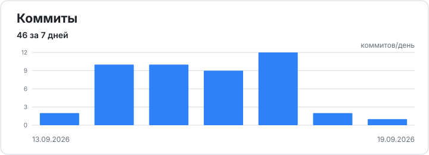
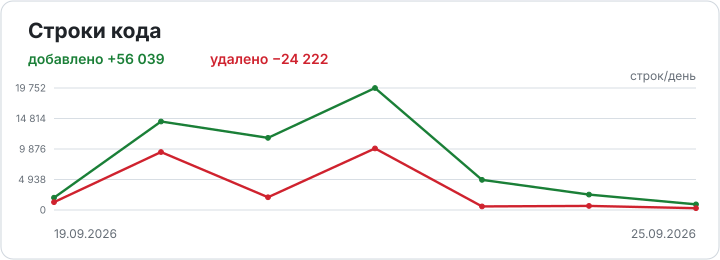
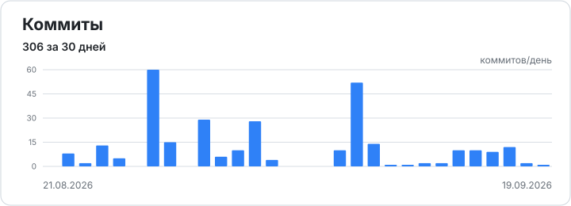
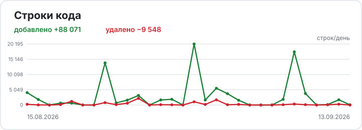
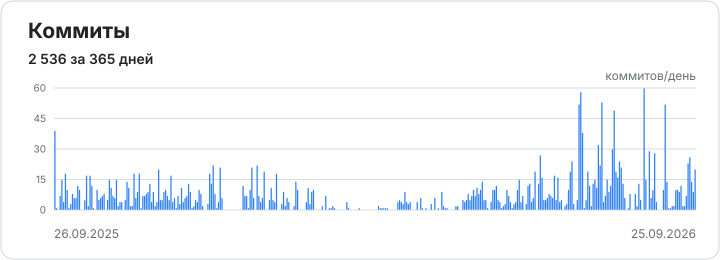
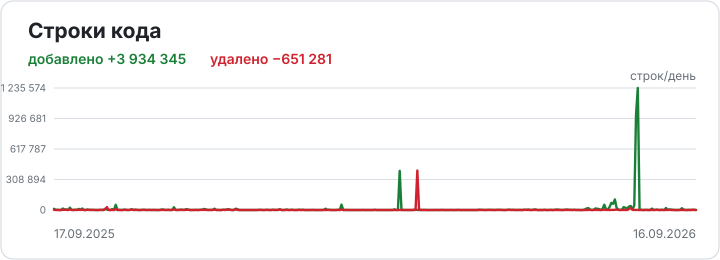
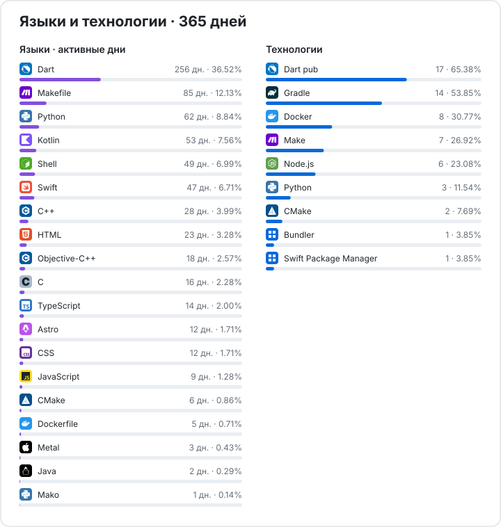

<!-- Generated by it-activity. Do not edit manually. -->

<strong>Последние 7 дней</strong>

<strong>Последние 30 дней</strong>

<strong>Последние 365 дней</strong>

## Языки и технологии за 365 дней

